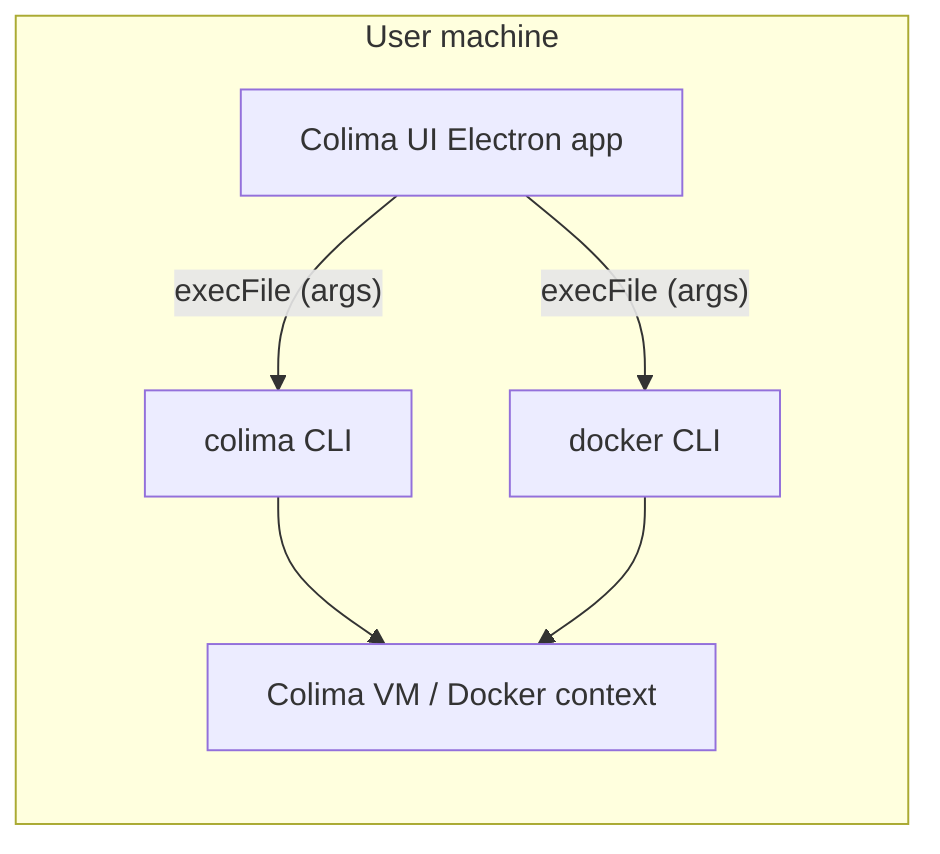
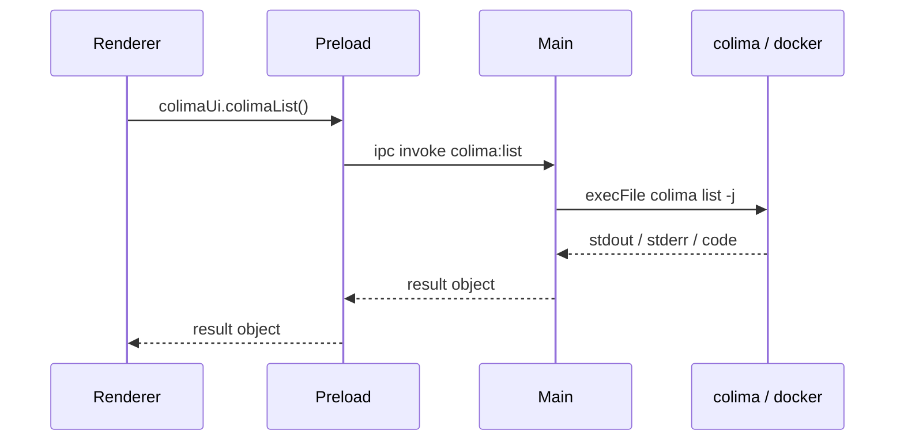

# Architecture — Colima UI (POC)

**Version:** 0.1  
**Companion:** [REQUIREMENTS.md](./REQUIREMENTS.md), [README.md](../README.md), [workflow.md](../workflow.md)

---

## 1. Context

The application is a **local desktop client** that orchestrates **user-installed** command-line tools. It does not host containers or the Colima VM; it is a **thin control and visibility layer**.

**External actors:** end user.  
**External systems:** Colima-managed runtime, Docker API (via CLI and default socket / `DOCKER_HOST`), and (future) the Kubernetes API via `kubectl`.

---

## 2. Domain model (bounded contexts)

Separate **domain** modules keep Colima lifecycle, Docker visibility, and Kubernetes concerns from each other. Each domain owns its CLI arguments, parsing, and logging context; **only** `lib/cli.js` performs `execFile`.

| Domain | Module | Responsibility |
|--------|--------|------------------|
| **Colima** | `domain/colima/colima-operations.js` | Instance list, status, start/stop, version; parses `colima list -j` |
| **Docker** | `domain/docker/docker-operations.js` | Engine info, container/image/volume lists, version |
| **Kubernetes** | `domain/kubernetes/kubernetes-operations.js` | Reserved; `getNodes()` is a stub unless `COLIMA_UI_K8S_ENABLED=1` |

Cross-domain rules: **no** imports between `domain/colima`, `domain/docker`, and `domain/kubernetes`. Shared infrastructure lives under `lib/`.

---

## 3. Twelve-factor alignment (desktop interpretation)

Heroku’s [twelve-factor](https://12factor.net/) targets server apps; here we apply the same **ideas** to the Electron **main process**:

| Factor | How it shows up here |
|--------|----------------------|
| **I. Codebase** | One repo; domains under `domain/`. |
| **II. Dependencies** | Declared in `package.json`; no implicit global modules in app code. |
| **III. Config** | **Environment only** — `lib/config.js` reads `process.env` with defaults (binary paths, timeouts, log level, K8s feature flag). No checked-in secrets or per-machine config files for runtime. |
| **IV. Backing services** | **Colima / Docker / kubectl** are *attached resources*: paths configurable via env (`COLIMA_UI_*_BIN`), swappable like URLs in cloud apps. |
| **V. Build, release, run** | Build: `npm install`; run: `npm start`. (Packaging **[TBD]**.) |
| **VI. Processes** | One main window process + stateless IPC handlers; long work is subprocess-bound, not in-memory state machines. |
| **XI. Logs** | Main-process events as **JSON lines on stdout** via `lib/logger.js` (timestamps, level, message). |

Factors **VII–X** (port binding, concurrency, disposability, dev/prod parity) apply loosely: no network service in the POC; parity is “same env-driven CLIs as the terminal.” **XII. Admin processes** maps to running the same domains from a future REPL/script if needed.

---

## 4. Container view (logical)

| Container | Technology | Responsibility |
|-----------|------------|----------------|
| **Desktop shell** | Electron | Window lifecycle, IPC routing, subprocess execution |
| **UI** | HTML / CSS / JavaScript (renderer) | Present data, collect actions, call preload API |
| **Bridge** | Preload script | Expose a **fixed** API via `contextBridge` to the renderer |

No separate backend service or database in the POC.

---

## 5. Component responsibilities

| Component | Path | Role |
|-----------|------|------|
| **Main process** | `main.js` | Compose config + logger + domain factories; register IPC; no business logic |
| **Config** | `lib/config.js` | Env-driven settings (twelve-factor config) |
| **Logger** | `lib/logger.js` | Structured stdout logs from main |
| **CLI runner** | `lib/cli.js` | `execFile` wrapper only (no domain parsing) |
| **Terminal launch** | `lib/terminal-launch.js` | OS-specific spawn of Terminal / cmd / `x-terminal-emulator` for docker CLI |
| **ID validation** | `lib/docker-identifiers.js` | Container / image IDs / volume names before context-menu mutations |
| **Colima domain** | `domain/colima/colima-operations.js` | Colima use-cases |
| **Docker domain** | `domain/docker/docker-operations.js` | Docker use-cases (list, remove container/image/volume) |
| **Kubernetes domain** | `domain/kubernetes/kubernetes-operations.js` | Future kubectl use-cases |
| **Preload** | `preload.js` | `colimaUi.*` → `ipcRenderer.invoke` |
| **Renderer** | `renderer/app.js` (ES module entry) | Compose sidebar navigation, refresh, Colima actions |
| **Renderer modules** | `renderer/sidebar.js`, `renderer/refresh.js`, `renderer/colima-view.js`, `renderer/docker-view.js`, `renderer/*-context.js`, `renderer/colima-actions.js`, `renderer/utils.js` | Section nav, data fetch/render split by domain |
| **Presentation** | `index.html`, `styles.css` | Shell + sidebar layout, view panels |

---

## 6. Runtime model (Electron)

- **Main** is the only place that spawns subprocesses.  
- **Renderer** has no direct `require('child_process')` (`nodeIntegration: false`).

---

## 7. IPC contract (POC)

| Channel | Payload | Behaviour |
|---------|---------|-----------|
| `colima:list` | — | `colima list -j` → `{ ok, code, stdout, stderr, instances[], parseError? }` |
| `colima:status` | `profile?: string` | `colima status -j [profile]` → `{ ok, code, stdout, stderr, status }` |
| `colima:start` | `{ profile?, preset?: null \| "kubernetes" }` | `colima start …` long timeout |
| `colima:stop` | `{ profile? }` | `colima stop …` long timeout |
| `colima:version` | — | `colima version` |
| `docker:info` | — | `docker info --format '{{json .}}'` → `{ info }` |
| `docker:ps` | `{ filters?: string[] }` | `docker ps -a …` + `-f` per line → `{ containers[] }` |
| `docker:images` | `{ filters?: string[] }` | `docker image ls -a …` + one `-f` per `key=value` line → `{ images[] }` |
| `docker:volumes` | `{ filters?: string[] }` | `docker volume ls …` + `-f` per line → `{ volumes[] }` |
| `docker:version` | — | `docker version --format '{{json .}}'` |
| `containers:contextMenu` | `{ containerId, browserUrls?, x?, y? }` | Native **Menu**: attach/exec → terminal; **Open in browser** → `shell.openExternal` (parsed published ports); **Remove** → `docker rm -f` → **`docker:mutation`** |
| `images:contextMenu` | `{ imageId, x?, y? }` | Native **Menu**: **Remove image** → confirm → `docker rmi -f` → **`docker:mutation`** |
| `volumes:contextMenu` | `{ volumeName, x?, y? }` | Native **Menu**: **Remove volume** → confirm → `docker volume rm -f` → **`docker:mutation`** |
| *(main → renderer)* `docker:mutation` | — | Fired after successful **rm** / **rmi** / **volume rm** so UI can **refresh** lists |
| `kubernetes:getNodes` | — | If `COLIMA_UI_K8S_ENABLED=1`: `kubectl get nodes -o json`; else `{ notImplemented: true, … }` |

All responses include at least `{ ok, code, stdout, stderr }` from `runBinary` unless noted; parsers may add fields.

---

## 8. Key decisions (ADR-style)

### ADR-001 — Electron + Node main process

- **Decision:** Use **Electron** with **Node** in the main process for subprocess control and **HTML** in the renderer.  
- **Alternatives considered:** **Tauri** (Rust main — diverges from “Node.js desktop” ask); **menubar wrapper + local web server** (more moving parts for a POC).  
- **Consequences:** Larger install footprint than a native menubar app; familiar pattern for CLI-wrapping tools; full access to `child_process` in main.

### ADR-002 — CLI integration via `execFile`

- **Decision:** Use `child_process.execFile` with **argument arrays** and explicit timeouts.  
- **Alternatives considered:** Shell (`exec`) with string commands — rejected (injection risk). Raw `spawn` with streaming — deferred (POC does not need live logs).  
- **Consequences:** Simple error handling; large output buffered (`maxBuffer` set); long start/stop need generous timeout.

### ADR-003 — Refresh-only UI

- **Decision:** No background polling or file watchers.  
- **Consequences:** Lower complexity and battery use; user must click **Refresh** after external CLI changes.

### ADR-004 — Domain modules + env-only config

- **Decision:** Split **Colima**, **Docker**, and **Kubernetes** into separate `domain/*` factories; read **all** tunables from `process.env` in `lib/config.js`.  
- **Consequences:** Clear boundaries for future `kubectl` UI; tests can inject deps; no silent machine-specific config in git.

---

## 9. Security and trust boundaries

| Concern | Mitigation (POC) |
|---------|------------------|
| **Renderer code execution** | `nodeIntegration: false`, `contextIsolation: true` |
| **IPC surface** | Preload exposes only named methods; no arbitrary channel names from renderer |
| **Command injection** | No shell; fixed command names; profile passed as discrete `execFile` argument |
| **Privilege** | Same user as interactive terminal; no separate privilege model **[TBD]** if elevated ops are ever required |

**Note:** Binaries default to `colima`, `docker`, `kubectl` on `PATH`; override with `COLIMA_UI_*_BIN` — same trust model as the user running those binaries in a terminal.

---

## 10. Failure modes (operational)

| Scenario | Expected behaviour |
|----------|---------------------|
| `colima` / `docker` missing | `execFile` error; stderr surfaced; empty or partial UI |
| Colima stopped | `colima status -j` may fail; **list** JSON still used for instance row |
| Docker daemon unreachable | `docker info` / `ps` fail; summary shows fallback message |
| Start/stop exceeds timeout | `runBinary` marks killed / timeout **[TBD]:** distinguish in UI copy |

---

## 11. Future architecture hooks **[TBD]**

- **Kubernetes UI** wired to existing `kubernetes:getNodes` and expanded commands.  
- **Streaming logs** for `colima start` (switch to `spawn`, IPC events).  
- **Packaging** (electron-builder) and code signing.  
- **Settings UI** that writes env or uses `electron-store` (today: env only).

---

## 12. Related documentation

| Document | Purpose |
|----------|---------|
| [REQUIREMENTS.md](./REQUIREMENTS.md) | FR/NFR IDs and traceability |
| [designs/README.md](./designs/README.md) | Design doc index (non-FR UX decisions, component library) |
| [designs/design-decisions.md](./designs/design-decisions.md) | **DD-*** decision records |
| [designs/component-library.md](./designs/component-library.md) | UI tokens, layout, class-level catalog |
| [../README.md](../README.md) | Quick start and CLI mapping |
| [../workflow.md](../workflow.md) | Full Istio/Colima lab after VM is up |

Does this look right?
